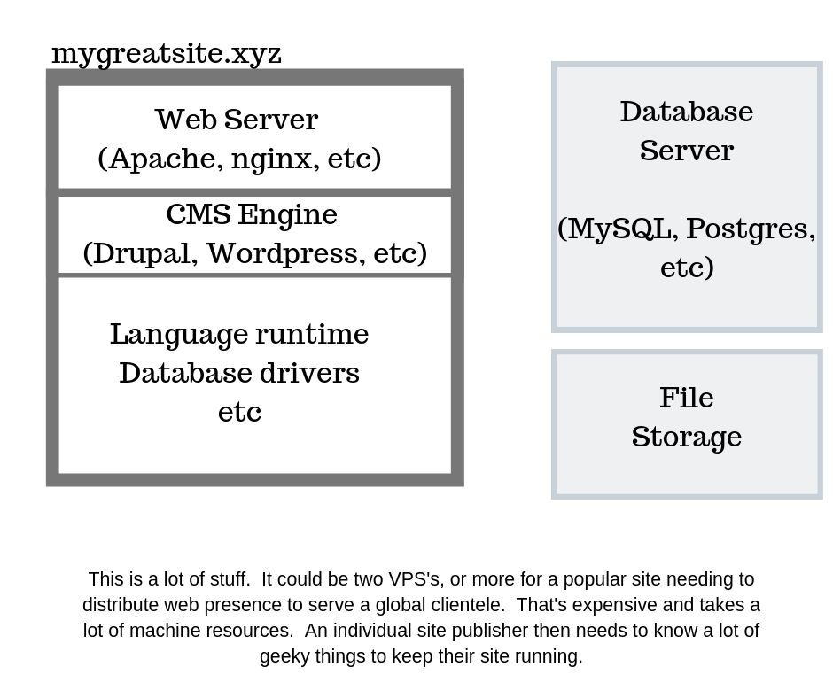
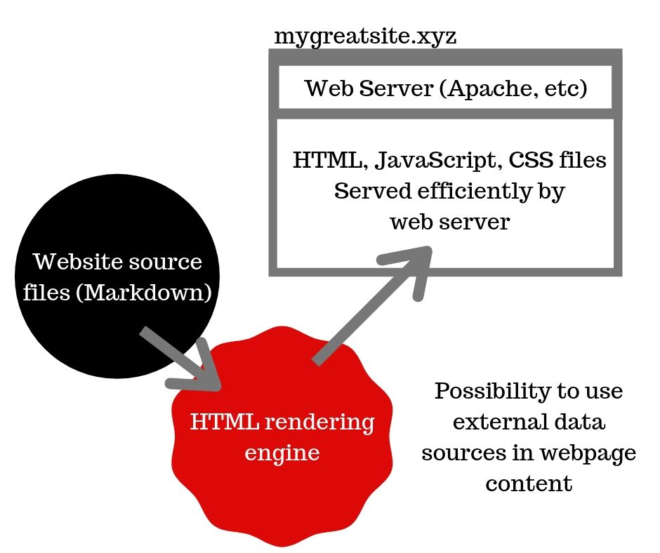

With that lead-in the answer to the question should be fairly obvious:  

* A website containing just HTML files can be run off a simple low-end hosting account
* The low-end hosting account is a fraction of the cost of VPS required to run a dynamic CMS
* The low-end hosting account requires less computation resources - a fraction of a squidgeon of an Apache server, versus running a PHP execution environment for every page request - than do dynamic CMS's
* In theory an HTML-only website has fewer attack surfaces for computer criminals to intrude website security

It seems we should back up a few feet so I can describe a static website generator, in my words.

There's a variety of dynamic CMS's - Drupal and Wordpress being just two - where the HTML for web pages is dynamically generated for each page request.  I first started using a dynamic CMS somewhere around 2000, and quickly gravitated to Drupal because I wanted to build community websites.  The design of Wordpress at the time seemed too icky, FWIW.  At the time I found it fantastic that every page could be customized even for the individual user.  A user of a site could theoretically goo into the site settings and configure sidebar widgets or theming choices, and the dynamic CMS could take care of all that.

Software engineers are always looking for flexibility, and in theory that's what dynamic CMS's offer.  Complete flexibility to present the content as you like.

But then I noticed - it took a lot of machine resources to host my websites.  One expensive CMS was not enough, I had two or maybe three VPS's at one time, costing well over $100 a month in hosting costs.

<figure>

</figure>

The cost of this nagged away in my thinking.  I am very concerned about the environment - I spend a lot of time writing news articles and other content about electric vehicles and clean energy technology.  The impact of hosting those websites did not sit well with what it took to host my websites.

Why was all that needed?  Why not just use HTML files?  The Disqus service could handle user comments, for example.  If the website is a blog - with no room to allow the readers to customize the presentation - why sustain the cost of dynamically generating the page for each page view?

The architecture image is of course incomplete.  For example Drupal and Wordpress both have complex caching systems available that can avoid a lot of the dynamic content rendering cost.  But the existence of those systems just makes the argument that stronger.  Why rely on an overly complex system that's bending itself over backward to just generate HTML, when you could pre-render the HTML?

And by the way, the hosting cost would be less, as would be the resource impact.

<figure>

</figure>

Clearly this architecture involves a lot fewer moving parts.  

In theory Apache or nginx or the like could handle a huge traffic volume - they're just reading the prerendered file off disk, and sending it to the requestor.

Clearly this doesn't handle every website use case.  Many types of website need to dynamically generate pages for every page view.  A site showing the latest pricing for, oh, Bitcoin, obviously needs to query the pricing chart.