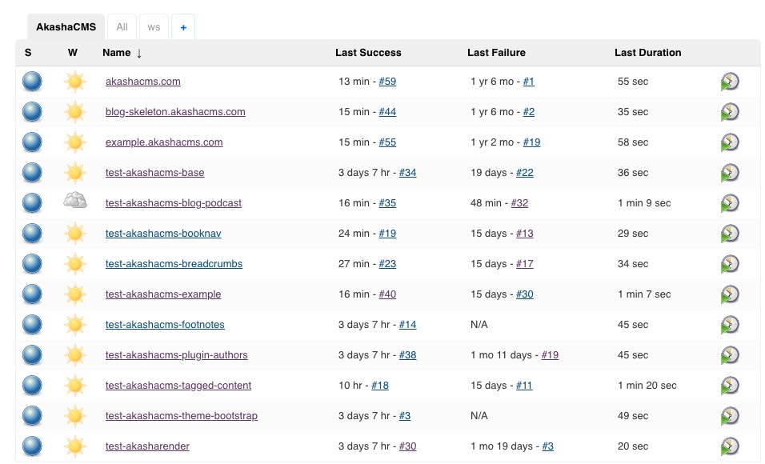

This is the end result of the work - a Jenkins instance in which AkashaCMS modules are automatically tested, and if appropriate the updated package is published to the npm repository.  Additionally the web properties like `akashacms.com`, and `example.akashacms.com`, have automated build jobs that can be kicked off as needed.

In the past I'd used the `example.akashacms.com` website to test AkashaCMS packages.  The testing was completely manual, in that I'd manually set up the package in the workspace, manually run the build, and manually check the resulting HTML files.  Many times I skipped the testing, and sometimes that bit me with unchecked bugs.

Today most of the AkashaCMS packages have tests within the source repository.  The tests are not published as part of the npm package, in order to minimize the size of the packages.

In each such package there is a `test` subdirectory.  In that directory is a `package.json`, and an `index.js`.  The latter contains the test suite written with the Mocha library, using Chai assertions.  The `package.json` is set up so you run these commands:

```
$ npm run setup
$ npm test
```

The first installs all needed packages, and performs any other setup, while the second obviously runs the test.

The job in the Jenkins instance runs those commands.  Then if everything runs correctly (the tests pass) it attempts to publish the package to the npm repository.  This, of course, will succeed only if the version number in `package.json` has changed.

With this completed I'm now able to:

* If a website build fails, to try and replicate the failure in the corresponding AkashaCMS package test suite.  That of course increases the number of tests, ensuring the same failure will not occur in the future.
* Develop new features simultaneously with corresponding tests
* The commit for a new feature includes the tests (and the documentation)
* Be able to publish new package versions just by pushing to the repository
* Be assured that packages work before publishing to npm

Look closely at the Jenkins configuration shown above.  It demonstrates that on multiple occasions the automated testing found bugs which I was able to fix quickly.  It also shows that the test execution time is satisfyingly 1 minute or less in most cases.

