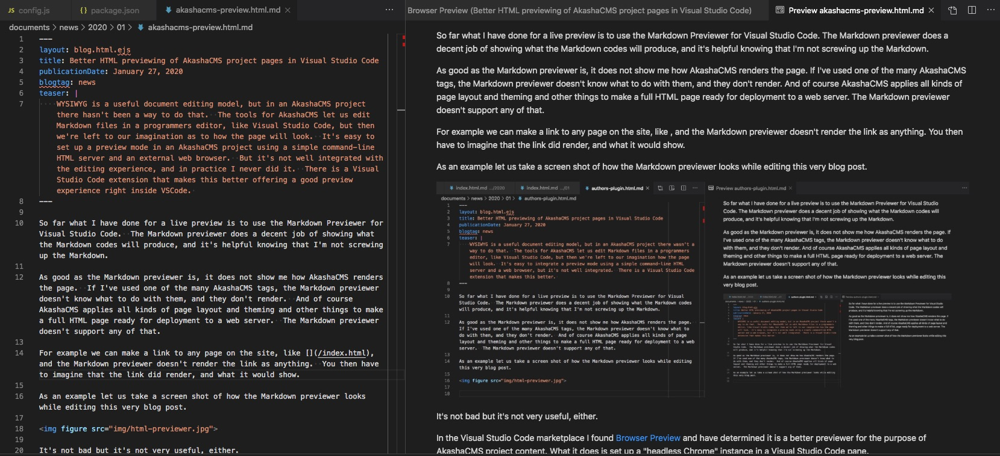
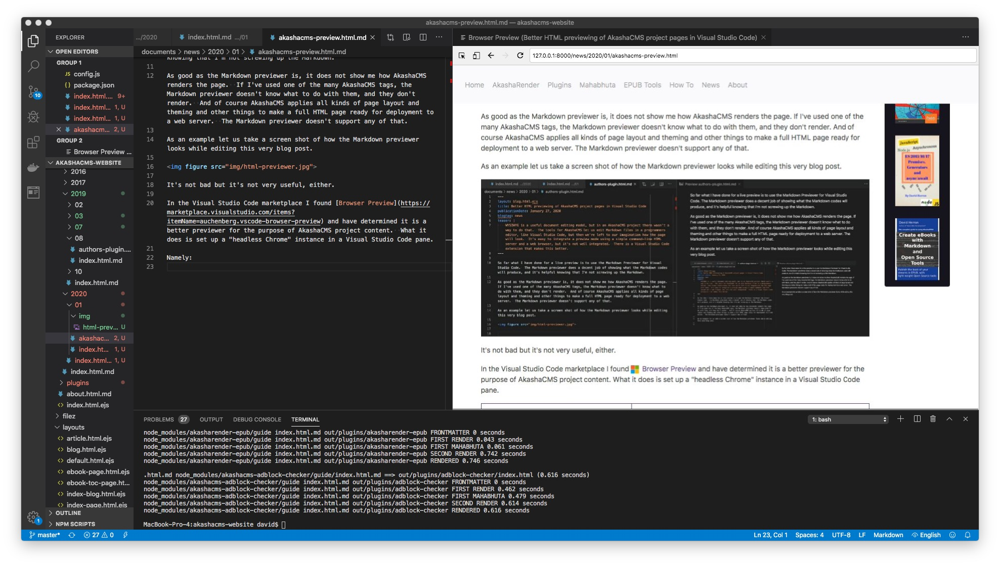
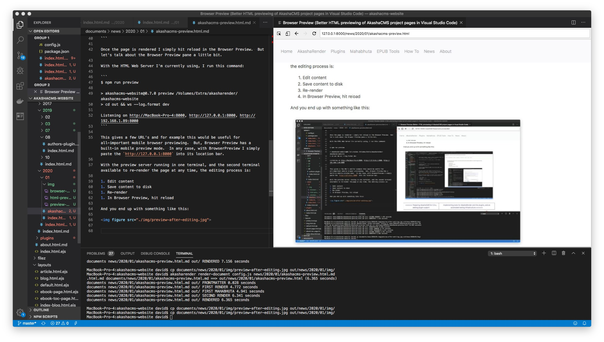

So far what I have done for a live preview is to use the Markdown Previewer for Visual Studio Code.  The Markdown previewer does a decent job of showing what the Markdown codes will produce, and it's helpful knowing that I'm not screwing up the Markdown.

As good as the Markdown previewer is, it does not show me how AkashaCMS renders the page.  If I've used one of the many AkashaCMS tags, the Markdown previewer doesn't know what to do with them, and they don't render.  And of course AkashaCMS applies all kinds of page layout and theming and other things to make a full HTML page ready for deployment to a web server.  The Markdown previewer doesn't support any of that.

For example we can make a link to any page on the site, like [](/index.html), and the Markdown previewer doesn't render the link as anything.  You then have to imagine that the link did render, and what it would show.

As an example let us take a screen shot of how the Markdown previewer looks while editing this very blog post.



It's not bad but it's not very useful, either.

In the Visual Studio Code marketplace I found [Browser Preview](https://marketplace.visualstudio.com/items?itemName=auchenberg.vscode-browser-preview) and have determined it is a better previewer for the purpose of AkashaCMS project content.  What it does is set up a "headless Chrome" instance in a Visual Studio Code pane.  With that we get a high quality preview as it would be viewed in a real web browser.

Namely:



What we have here is - 

* Browser Preview in a VSCode pane
* A terminal window at the bottom
* AkashaCMS/Markdown source for this blog post in another pane.

The Browser Preview pane is close to a full web browser, in a VSCode pane.  It has a location bar to enter URL's, forward and back buttons, and most importantly a reload button.

There are two active terminals:

* he invisible terminal is running a simple web-server that is pointed at the rendered website directory.
    * To prepare, I ran `npm run build` to render this website, giving me initial rendered HTML for this page.  
* In the visible terminal, I then run this command to re-render this page:

```
$ akasharender render-document config.js news/2020/01/akashacms-preview.html.md 
.html.md documents/news/2020/01/akashacms-preview.html.md ==> out/news/2020/01/akashacms-preview.html (2.48 seconds)
documents news/2020/01/akashacms-preview.html.md out/ FRONTMATTER 0.032 seconds
documents news/2020/01/akashacms-preview.html.md out/ FIRST RENDER 0.074 seconds
documents news/2020/01/akashacms-preview.html.md out/ FIRST MAHABHUTA 0.183 seconds
documents news/2020/01/akashacms-preview.html.md out/ SECOND RENDER 2.437 seconds
documents news/2020/01/akashacms-preview.html.md out/ RENDERED 2.482 seconds
```

Once the page is rendered I simply hit reload in the Browser Preview.  But, let's talk about the the implementation in more depth.

This site is configured with a `preview` script that uses a simple Web Server that an be run from the command line.  To use it, I run this command:

```
$ npm run preview

> akashacms-website@0.7.0 preview /Volumes/Extra/akasharender/akashacms-website
> cd out && ws --log.format dev

Listening on http://MacBook-Pro-4:8000, http://127.0.0.1:8000, http://192.168.1.89:8000
```

This gives a few URL's to visit.  We don't strictly speaking need a web browser component to be embedded in a VSCode pane.  We could use an external browser.  Also, there is the all-important mobile browser previewing which can be done on a real mobile device.  But, I'm finding Browser Preview's web browser in a VSCode pane to be very nice, and it even has a built-in mobile preview mode.

In any case, with BrowserPreview I simply paste the `http://127.0.0.1:8000` into its location bar.  That's visible in the screen shot above.  This URL is obviously the base URL of the website, but we can easily navigate to any page by clicking on links.

This is significantly different from the other HTML previewers in the VSCode marketplace.  Those simply show the rendered HTML in a VCScode pane.  That's nice, but how is it supposed to find the CSS files?  For an image SRC or link HREF that uses an absolute local URL, how does the previewer know where to look in the file system to find the file?  Does it run the embedded JavaScript to ensure correct rendering?  

Those issues explain why a web server is required, and why a complete web browser component is required. The web server knows how to interpret a request for a file from an absolute local URL, and the web browser component executes embedded JavaScript.

With the preview server running in one terminal, and the second terminal available to re-render the page at any time, the editing process is:

1. Edit content
1. Save content to disk
1. Re-render
1. In Browser Preview, hit reload

And you end up with something like this:



This is very cool.  It's what I've wanted to have for years of using AkashaCMS, but simply hadn't bothered.  However there are a couple things that remain to be done to make this excellent:

1. You'll notice I'm manually copying image files into the rendered output directory.  That should be automated.
1. There should be a live renderer for AkashaCMS project content.  
1. In other words, the process should just be SAVE then the live renderer (that doesn't exist yet) takes care of re-rendering automatically, and likewise the background web-server supports live reload.
1. The performance of `akasharender render-document` should be improved.  It's taking 7 seconds on my laptop to re-render this simple page.

What I want is what's said in that third point, namely:

1. Edit content - then SAVE
1. Automatic processes occur in which
    1. The page of the AkashaCMS project is re-rendered
    1. Live preview in a VSCode pane automatically refreshes

In my copious free time, that will be my next task for AkashaCMS.


