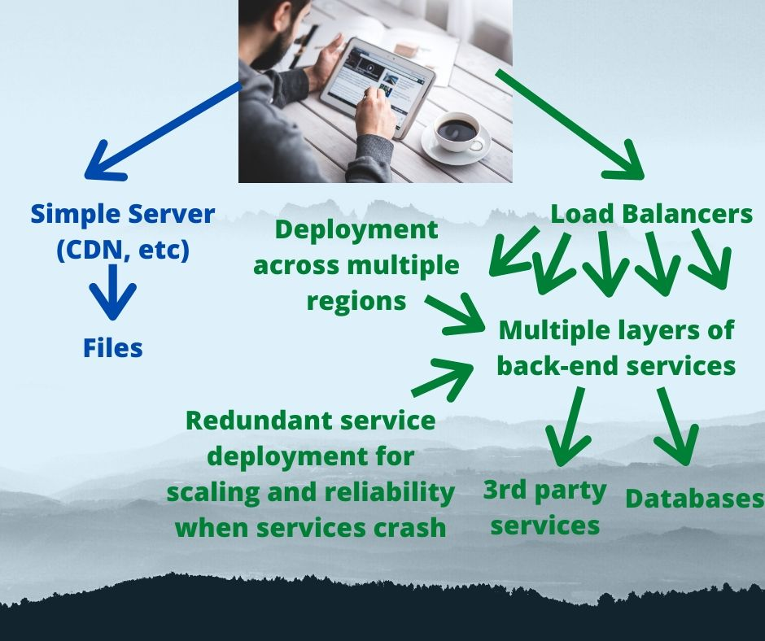

In the beginning (of the web) websites were HTML files (and images) you uploaded to a web server using FTP.  That's it.  My first websites, in 1994-1995, were coded that way, and of course I used FTP.  A big advance was finding a programmers editor, that handled HTML syntax coloring, and which could directly edit files in remote directory structures.  That meant not having to upload using FTP, and the syntax coloring made it a little easier to edit the HTML.  Another advance was a feature called _Server Side Includes_, letting one have sidebar or header or footer "widgets" loaded as HTML snippets from a shared directory.  That simplified having a consistent look across the website.  Then came the variety of pseudo-WYSIWYG HTML editors where we could edit web pages visually, rather than guessing what the page looked like while editing raw HTML.  These editors didn't support server side includes, but there was a similar feature in Dreamweaver allowing one to have shared HTML snippets.

The point is that a website built with simple HTML files is not a new concept.  We've been doing that since the beginning of the Web.

The story for both JAMStack and Static Website Generators is that there's a big speed advantage with static HTML+CSS+JavaScript rather than deploying a dynamic content management system (CMS) or a custom server-side application.  There's no complex server-side code for rendering the pages.

For me, both are a reaction to complicated dynamic CMS's, or complex custom micro-services deployed to cloud hosting.  Over the years of learning the intricacies of Drupal 6 and Wordpress, learning how to customize Blogger templates, and learning Docker and Docker Swarm, I came away with a distaste of the burden it is to host a complex content management system which dynamically generates pages.  At one time I was maintaining 10 or so Drupal instances for different websites, managing multiple VPS's, facing a never ending grind of updating modules on each site, and worrying how I would pay the hosting bill.

As a result of those experiences I developed my own static website generator, AkashaCMS.  With it the hosting bill is minuscule, and the page load time for users of the websites is excellent.

The JAMStack and static website generator proponents are preaching a similar vision - modern HTML+CSS+JS - static assets for speed - simplified deployment - eliminating complexity - so let's start with this question...

# What is JAMStack?

The JAMStack concept is defined as "_Fast and secure sites and apps delivered by pre-rendering files and serving them directly from a CDN, removing the requirement to manage or run web servers._"  To drive the point home the acronym, JAM, means:

* (**J**) JavaScript executed in a web browser page as the client tier
* (**A**) API's hosted on servers are accessed by client-side JavaScript to retrieve data
* (**M**) Markup, both as HTML and HTML templates, are used to dynamically update pages using the JavaScript and retrieved data
* (**STACK**) Because, well, every software product is described as a Stack, right?

That's simple enough, static assets and fast page load times.  But the JAMStack definition says "_sites or apps_" and requires deployment to a CDN.  Why do they explicitly call out those points?  Is there a real difference between JAMStack and a static website generator?

In a system like AkashaCMS, the user edits Markdown or AsciiDoc files, then runs a tool to render those files to HTML+CSS+JS, and uses _rsync_ to deploy to a web server.  This is the JAMStack and statically generated website model, uploading static HTML+CSS+JS assets to a hosting system.  A couple observations:

* A statically generated website does not **require** backend API's or DOM manipulation, but can include JS that calls backend API's and performs DOM manipulation, if needed
* We can use modern HTML+CSS+JS in a statically generated website
* The statically generated website can be hosted on cheap shared web hosting that uses Apache or NGINX web-servers
* Such websites can be hosted to a CDN to aid delivery to readers around the world
* Why is there an insistence on deployment to a CDN?

In other words - a JAMStack site is a subset of the statically generated websites, since JAMStack is a statically generated website with additional constraints.  In both cases pre-rendered HTML+CSS+JavaScript are deployed to a hosting location, and the hosting location does nothing other than deliver the files to web browsers.  The difference is the reliance on JavaScript and API's and DOM Manipulation.

With both, we skip a bunch of complexity and cost arising from using dynamically executed services to dynamically generate websites (e.g. Drupal or Wordpress).

But, why do JAMStack proponents insist on using a CDN?  **What is a CDN?** A CDN, a.k.a. Content Delivery Network, is a cloud based service for distributing assets to remote servers around the world.  The promise is high performance, in part to automatically distribute content to CDN endpoints around the world.

# Why insist on a CDN?

In the JAMStack literature the task of "managing a webserver" is described as a huge burden.  The CDN is described as being "serverless", which is described as a huge advantage.  Of course _serverless_ is rather silly because of course CDN's are built from zillions of servers.  What that really means is that the person deploying the code isn't involved with the overhead of provisioning and managing servers.  The customer doesn't have to configure the servers.  We just deploy our code, and the serverless service takes care of the rest.  With a CDN, you upload the files, and the CDN takes care of both the servers and distributing your HTML+CSS+JS assets around the world.

CDN's primary stated advantage is that the CDN guarantees similar performance anywhere in the world.  With traditional hosting from a single web server -- my sites are hosted on shared hosting rented from Dreamhost whose servers are in southern California -- the distance from that server affects speed of accessing the website.

According to Google Analytics the page load speed for my websites (all hosted on simple shared Apache web hosting) is under 20 milliseconds.  Seems to me that 20 milliseconds is pretty close to _blazingly fast_.  I haven't tried hosting a site on a CDN and don't know if CDN's deliver content even more blazingly fast.  A reader of my sites in Uganda might see slower page loading times than a reader in Huntington Beach California.  Hosting on a CDN is supposed to equalize the two.

Additionally, CDN providers truly offer _unlimited bandwidth_ (at a fee).  The traditional shared hosting providers, like Dreamhost, offer unlimited bandwidth, but there is often an unstated usage level beyond which the hosting provider will start sending emails demanding your site move somewhere else.  CDNs have performance guarantees that cannot be made by the traditional Apache-based web hosting provider.

# Where did JAMStack come from?

It seems that JAMStack came from _Front End Engineers_ who had been roped into the unnatural thing of writing back-end code.  Management might think that JavaScript is JavaScript, so a front engineer should surely be able to stand up Node.js services as the back end of their web application.  But the skillset of creating visual experiences with HTML, CSS and JavaScript is very different from the skillset of back-end deployment tools like Docker, Databases and Node.js.

Front-end engineering is oriented to visual and interactive effects, whereas back-end coding is about server deployments, service scaling, and the like.  It stands to reason a front-end engineer would balk at doing server deployments.

The folks talking about JAMStack focus on the ease of deploying applications.  The folks using static website generators, like me, are looking for a slightly different thing.  We have websites (blogs etc) to deploy, don't see the point of dynamically generating the content on every page view, and want a lower hosting cost.

# Avoiding complexity may be the biggest gain



This image demonstrates the advantage of both JAMStack and the websites rendered using a Static Website Generator.  The far simpler system is lower cost and lower resource impact and lower overhead to maintain and faster.

On the left (blue arrows and text) we have the model of deploying static assets.  They can be deployed to a CDN, as the JAMStack proponents insist, or to a simple Apache or NGINX server.  In both cases the user's web browser makes a request to a web server, and the web server simply sends back the file, and that's that.

On the right (with green text and arrows) we have a complex system deployed on cloud hosting infrastructure.  A cloud hosting platform like AWS has close to a zillion features, giving technologists lots of things to get excited about.  Global scale custom services of the type driving all kinds of websites are possible by configuring and using cloud hosting platforms.  It's a compelling model, because anyone can rent service that can scale from a small deployment to a globe spanning service at the click of a few buttons.  But trust me when I say that it is complex to learn, complex to understand, complex to grok how to minimize the costs, complex to manage, etc.

# Serverless is the real method for eliminating complexity

The JAMStack proponents praise CDN deployment, but what they should be praising is the _serverless_ concept.

There are a lot of hugely complex systems available in today's computing world.  Some kinds of websites require that complexity, because of the intense number of services to manage.

To build and maintain a system that works across multiple availability zones, automatically handles service failure, that handles automatic localization and internationalization, and much more, requires multiple teams of highly skilled engineers.  Not everyone can afford the cost of hiring such a deep talent base.

The _serverless_ approach offers a different route.  The service provider hires the engineering talent required to deploy a cloud based service, and we simply rent their service.  Whether it's a database service, a content distribution service, a cloud functions service, or any other service, we simply use the service providers website to rent the service.  The service provider's engineering team takes care of scaling to meet traffic, multi-zone availability, backups, reliability, and more.  Our task is simple - we configure the application stack with service access particulars, and get on with the business of writing application code.

It's so simple that an individual (or small team) can:

* Create an application using front-end JavaScript
* Deploy any custom back-end services to functions-as-a-service system
* Utilize database-as-a-service
* Utilize other 3rd party cloud services

All with no complexity, and the ability to quickly develop/deploy a website or web application.  All the complexity is handled by serverless service providers.

However, not all serverless services are equally simplified.  AWS Fargate is billed as a serverless version of AWS ECS or AWS EKS.  ECS is an AWS cloud service for hosting Docker containers, and EKS is the AWS service for running Kubernetes.  Fargate is _serverless_ in that you do not provision the servers involved in hosting the Docker containers, which does slightly simplify the task of hosting a Docker service.  But Fargate is still extremely complex.

In the next section let's talk more concretely about JAMStack implementation.

# That's nice theory, but what are JAMStack or static websites for real?

All of that was rather abstract, so let's look at some concrete examples of JAMStack.

At the simplest, JAMStack is an HTML page, containing JavaScript, where it makes API calls to services, using retrieved data to make changes to the HTML.  Let's take a look at some examples ...

## Commenting systems on static HTML or JAMStack websites

There were advantages to those dynamic CMS's.  For instance Wordpress and Drupal both integrate a native commenting system, and allow users to register with the website in order to leave comments.  It is possible to build a community via a website by allowing your readers to leave comments.  Why should we leave that and other features behind?

The first step is to render the content of the website using a static website generator.  There are many such systems each with different behaviors.  In most cases content is written in Markdown and rendered through templates to create the static HTML site.

Then, for each page where you want comments, add some JavaScript containing a commenting UI.  The JavaScript should be added to the template rather than the Markdown content, to simplify implementing comments across the website.  The commenting UI would make calls to a back-end commenting system, and also render a user interface in a given location in the web page.  For example:

```html
<div id="disqus_thread"></div>
<script type="text/javascript">
var disqus_shortname = 'site-name-slug';
var dsq = document.createElement('script'); dsq.type = 'text/javascript'; dsq.async = true;
dsq.src = 'https://' + disqus_shortname + '.disqus.com/embed.js';
(document.getElementsByTagName('head')[0] || document.getElementsByTagName('body')[0]).appendChild(dsq);
</script>
```

This is (more or less) the JavaScript provided by Disqus, a large scale commenting service.  It handles comments on websites, and has many useful tools for managing spammers and user authentication.

The Disqus UI integrates a number of back-end services.  For example users can sign up as a Disqus user without leaving the web page, and it can also authenticate people using 3rd party services like Facebook or Twitter.  Once a reader is authenticated, they can leave comments and the comments area is dynamically updated as others leave comments.

When I installed Disqus on a Blogger blog, or on a Drupal blog, that was not a JAMStack situation.  Simply using a JavaScript UI to a 3rd party service does not make it JAMStack.  That Drupal blog is its own complexity.  What makes it JAMStack is to use a static website generator so that you're deploying HTML+CSS+JS.

There are plenty of services like Disqus offering many services.  For example, a weather site might offer a widget displaying the current weather for the locale of the visitor.  And the embed widgets supplied by Facebook, Twitter, YouTube and other sites, are also examples of JavaScript UI's that call an API and modify the DOM.

## Custom back-end services in static HTML or JAMStack websites

Many websites have custom services as well.  Not every need fits into what a 3rd party service can provide, after all.

To take an example, one of my websites is a proper static HTML site, where one section has a service implemented in old school PHP.  The original version of that service was implemented in TCL in 1997, and sometime in the 00's I rewrote it to simplistic old-CGI-style PHP.  Today, the PHP scripts are rendered from templates by AkashaCMS and deployed with the HTML+CSS+JS of that website, but it's still the old-school PHP.

That website is therefore not pure static HTML, nor is it a JAMStack site.  According to JAMStack proponents, this has complexity and is something to avoid.  In this case the PHP implementation requires extra security measures.

There are close to a zillion reasons any given site might have custom dynamic services.  Not every need is satisfied by a prebaked third party service.  Since the JAMStack approach is not just about performance, but simplicity and security, that leads us to a question: What's the simplest, highest performance, and most secure way to use a custom dynamic service on a JAMStack site?

My mind turns immediately to a function-as-a-service platform like AWS Lambda, and the promises of scalability, performance, and baked-in security.

The JAMStack proponents would probably say to implement a custom service as:

* A back-end offering a JSON/REST API
* A JavaScript UI doing browser-side rendering of HTML for the user interface

It is easy to generate a static bundle for the JavaScript UI for deployment through a CDN.  On [one of my other sites](https://techsparx.com/software-development/vue-js/getting-started/) I wrote a tutorial about doing just that with Vue.js.  Using Webpack to build the Vue.js application bundle gives a directory containing static assets that can be deployed with the rest of the static website.  You then include it in the HTML like so:

```html
<div id="app"></div>
<script src="/dist/build.js"></script>
```

The JS code at the URL, in this case `/dist/build.js`, must be written to target the `div#app` element where it will initialize the application.

## Search engines indexing JavaScript UI's

One thing which stops me from doing this on my site is whether that would be indexable by search engines.  The HTML of the corresponding pages would have the JavaScript application, rather than the currently shown information.  How will search engines index the information supplied by that service?  In many cases, like mine, that information is a big value point of that website and many of the visitors are drawn to the site because of that information.

Over on the JAMStack website is a corresponding issue.  Namely, the list of factors that are **NOT** JAMStack websites includes:

> A single page app that uses isomorphic rendering to build views on the server at runtime.

I'm not certain what that phrase means, but it's clearly talking about server-side rendering.  The [Wikipedia page on Isomorphic JavaScript](https://en.wikipedia.org/wiki/Isomorphic_JavaScript) talks about a hybrid situation with both server-side and client-side rendering.  Possibly the JAMStack website is saying it is best for all rendering to occur on the client side using data retrieved from servers.

On that Wikipedia page, there is a discussion of the problem of search engines indexing sites that have client side rendering.  Rather, since that page presents Isomorphic Rendering as a good thing, it gives this as one of the benefits:

> More predictable SEO and Site Indexing: In order to index content that JavaScript apps render on client-side, Googlebot must run those JavaScript apps inside a full browser environment and capture the rendered DOM. This involves complex browser compatibility issues. Also, because JavaScript apps can make AJAX requests for further rendering, Googlebot must have a policy that controls apps’ network access. These are why getting your JavaScript app indexed properly by Googlebot is still challenging.

Hence, I am justified in my concern about whether this would impact search engine visibility of my site.  FWIW Vue.js claims to be indexable by search engines, so I might be overstating the issue.


## Websites as applications

Unlike the sites I normally create, some folks use a website as the location for an application.  Some examples are Slack, Discord, Google Mail, Canva, all of which are websites with a small amount of public content, and an area where you access an application.  Instead of the primary purpose being presenting written content like this, it is the application.

Clearly such a site is very similar to what I just described.  We'd use a static website generator to build the few normal web pages, plus the page(s) containing the JavaScript user interface.  As discussed in the previous section we'd build a code bundle for the JavaScript UI, and deploy it with the static website.

For back-end services, the UI would likely use a variety of 3rd party and custom services.  For the custom services you again are recommended to host on a serverless platform in order to keep it simple.

Following those recommendations would make this a JAMStack site.  

Such a site probably does not desire search engines to index the application.  Would a search engine find any indexable anything in a wordprocessor application UI like what we get on Google Docs?

# Summary

What we've learned is that a JAMStack site is similar to a static HTML website, but with a couple specific requirements.  Since the goal is simple system management, JAMStack sites are best hosted on serverless platforms.

Otherwise, JAMStack is little different than what we've called _static HTML websites_ for some time.  Both involve static bundles of HTML, JavaScript and CSS, with the goal of improving speed and user experience for the folks reading our websites.

But there's this issue about insisting JAMStack sites/applications must be on a CDN.  I fully understand the goal of "_Jamstack projects don’t rely on server-side code_" since that eliminates a bottleneck to delivering blistering performance.  Clearly the JAMStack website insists on CDN deployment, but is that the only rational choice?

In my experience, for the traffic level I deal with, Apache on a simple shared web hosting provider is sufficient for excellent page load times.  One thing the JAMStack site says is:

> The thing that they all have in common is that they don’t depend on a web server.

Instead we're supposed to depend on serverless services, which of course are built from servers.  What _serverless_ means is _other peoples servers_, and the advantage to that is a simplified management experience.  That's what JAMStack means by not depending on a web server.

I guarantee that with Dreamhost I'm not involved with server management either.  I have a half dozen static HTML sites on a simple shared Apache account on Dreamhost, and have zero involvement with managing the server.  I simply use _rsync_ to upload the HTML+CSS+JS to the server and everything is hunky dory.  I wish the JAMStack site weren't so stuck on this anti-server stance.
