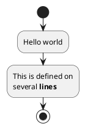

By using the `@akashacms/diagram-makers` plugin, it's easy to integrate diagrams using any of several digramming tools.

It is just as simple as adding this PlantUML diagram to a Markdown file:

```
@startuml
start
:Hello world;
:This is defined on
several **lines**;
stop
@enduml
```

You surround that text with a Markdown code block using the "plantuml" language, and this diagram is created:




## Installing and configuring `@akashacms/diagram-makers`

In an AkashaCMS project directory, run:

```shell
$ npm install @akashacms/diagram-makers --save
```

There is a command-line tool:

```shell
$ npx diagram-makers
Usage: diagram-makers [options] [command]

Options:
  -h, --help                   display help for command

Commands:
  plantuml [options]           Render PlantUML files
  plantuml-download [options]  Download the PlantUML JAR file for use with the PLANTUML_JAR environment variable
  pintora [options]            Render Pintora files
  mermaid [options]            Render Mermaid files to SVG
  katex [options]              Render TeX math files to KaTeX HTML markup
  help [command]               display help for command
```

With those you can render diagrams using the named tools.

In your AkashaCMS configuration, add this import statement:

```js
import {
    DiagramsPlugin,
    MarkdownITMermaidPlugin,
    MarkdownITPlantUMLPlugin
} from '@akashacms/diagram-makers';
```

Supporting inline diagram rendering means installing these Markdown-IT extensions:

```js
config.findRendererName('.html.md')
    // ...
    .use(MarkdownITMermaidPlugin, {
        // All options are optional
        // themePreset: 'forest',
        // configJSON: await fsp.readFile('mermaid-config.json', 'utf-8'),
        // fontFNs: [ '/path/to/Roboto.ttf' ]
    })
    .use(MarkdownITPlantUMLPlugin);
```

Then, to add custom tags:

```js
config
    // ...
    .use(DiagramsPlugin)
    // ...
```

## Using the CLI tool to render diagrams

The activity diagram shown above has been saved in the `akashacms-website` repository as `documents/quick-start/img/activity1.puml`.

This command converts that file to a PNG:

```shell
$ npx diagram-makers plantuml \
    --input-file documents/quick-start/img/activity1.puml \
    --output-file documents/quick-start/img/activity1.png \
    --tpng
```

The output file extension can be `.svg` instead of `.png` in which case you should use `--tsvg` instead.  You can also render Mermaid, Pintora, or KaTeX by changing the command name.  The same `--input-file` and `--output-file` CLI experience is used.

In any of these cases, the file is converted from its diagram format into either PNG or SVG.

A document referring to the rendered image uses this:

```html

```

Which results in


## Using custom tags to render diagrams

The `@akashacms/diagram-makers` plugin also install custom elements for rendering diagrams for display on a web page.

For example:

```html
<diagrams-plantuml
    input-file="./img/activity1.puml"
    output-file="./img/activity1.png"
    tpng/>
<diagrams-plantuml
    input-file="./img/activity1.puml"
    output-file="./img/activity1.svg"
    tsvg/>
```

This results in:

<diagrams-plantuml
    input-file="./img/activity1.puml"
    output-file="./img/activity1.svg"
    tsvg/>

As with the `npx diagram-makers` command, you can substitute the name of other diagram systems (e.g. `<diagrams-mermaid>`) and change the file extension of the input file.

By leaving off the `input-file=` attribute, the diagram descriptor can be read from the body of the element:

```html
<diagrams-plantuml
    output-file="./img/activity1.png"
    tpng>
@startuml
start
:Hello world;
:This is defined on
several **lines**;
stop
@enduml
</diagrams-plantuml>
```

Which results in:

<diagrams-plantuml
    output-file="./img/activity1.png"
    tpng>
@startuml
start
:Hello world;
:This is defined on
several **lines**;
stop
@enduml
</diagrams-plantuml>

One can leave off the `output-file=` attribute in which the conversion must bet to SVG.  In this case the diagram becomes inline to the HTML.

```html
<diagrams-plantuml tsvg>
@startuml
start
:Hello world;
:This is defined on
several **lines**;
stop
@enduml
</diagrams-plantuml>
```

Which results in

<diagrams-plantuml tsvg>
@startuml
start
:Hello world;
:This is defined on
several **lines**;
stop
@enduml
</diagrams-plantuml>

## Using inline diagram descriptions to render diagrams

As we showed at the top, we can place the diagram description inline using the Markdown code fence construct.

```


Make sure to add the closing code fence.

Which renders as:


The output in this case is inline SVG.

At the moment this is only supported for `plantuml` and `mermaid`.

